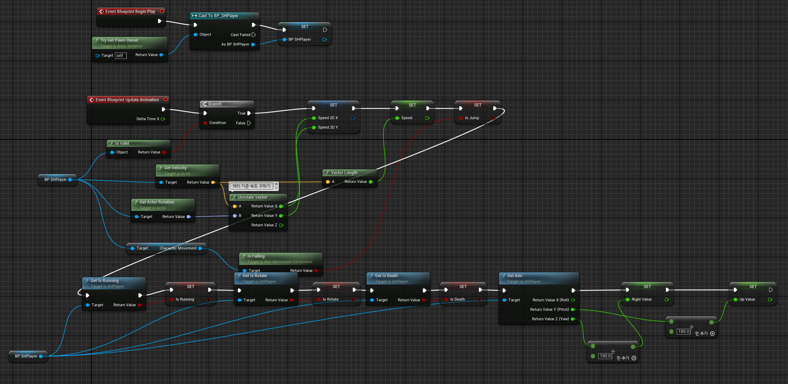
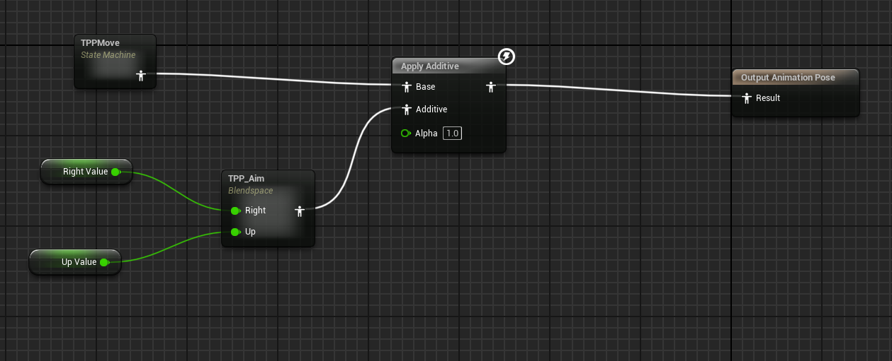
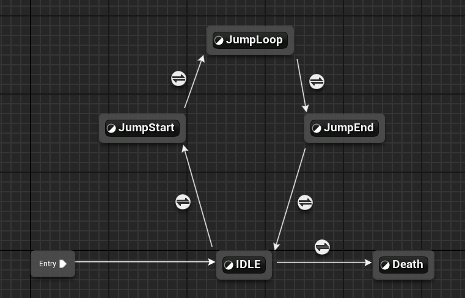
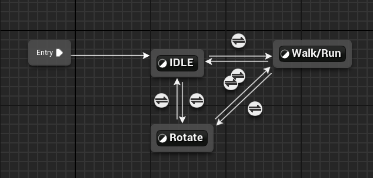
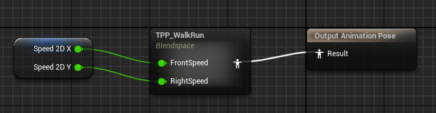
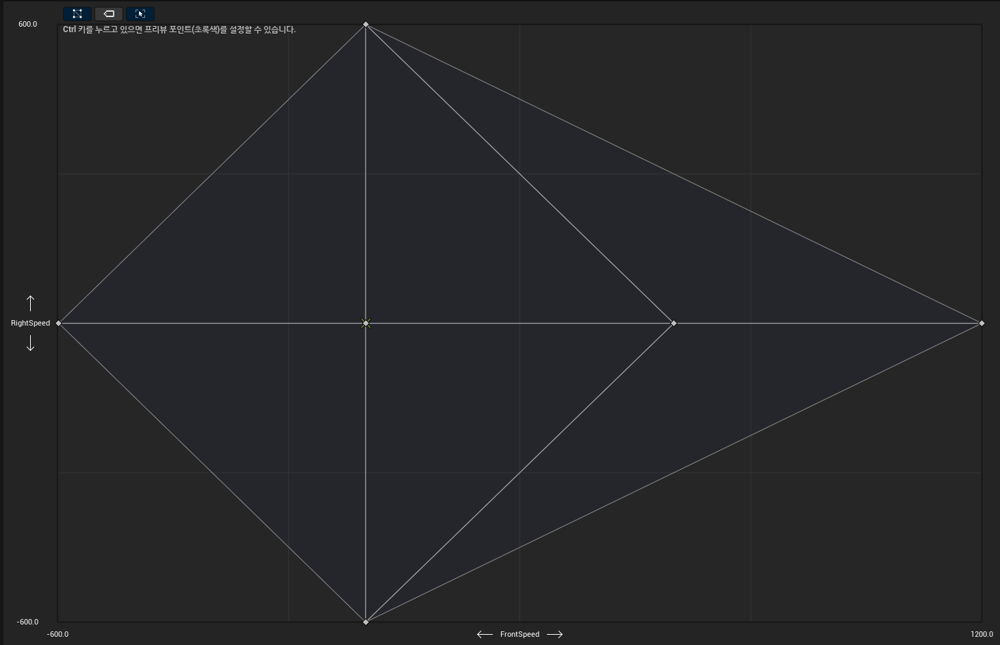
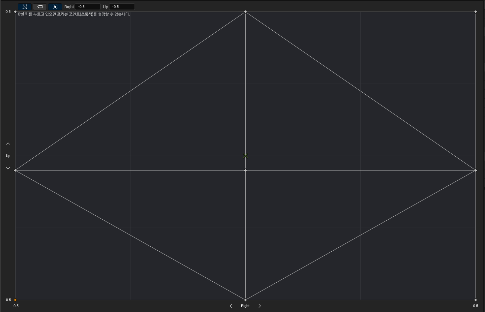
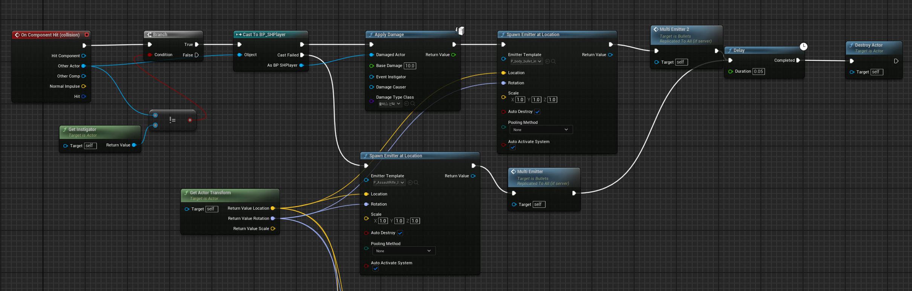
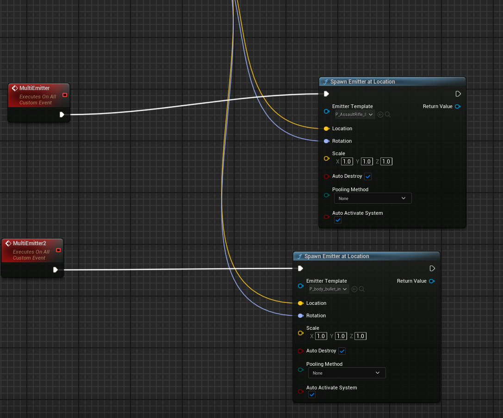

# ProjectShoot
### FPS와 TPS가 함께 있는 멀티 플레이 슈팅게임을 언리얼 엔진을 통해 제작한 포트폴리오
    적절한 엄폐와 기습을 통해 적을 물리치자!
- 개발 규모 : 1인
- 사용 엔진 : Unreal Engine 5.4.4
- 개발 도구 : C++(Visual Studio), BluePrint
- 사용 어셋 : UE Legacy Sample
- 사용 온라인 서브 시스템 : Steam
# 시연 영상
## 플레이 영상

# 개발 범위
## SHPlayer
    ACharacter를 상속받아 실제 플레이어에 관해 구현해 놓은 코드
### 기능
|이름|키|
|------|---:|
|기본 이동|w a s d|
|달리기|LShift|
|공격|LeftClick|
|줌|RightClick|
|점프|Space|
|시선 이동|MouseMove|
### 주요 변수
- SpringArm : Camera의 위치를 플레이에 상대적으로 바꾸기 위해 USpringArmComponent를 이용하여 만든 변수, 이를 조절하여 시점을 변경함
- TPSCamera : 이 위치가 유저의 시점이 되어 플레이어를 볼 수 있게 함
- FPSWeapon : FPS로 시점이 변경되었을 때 유저 앞에 조준선과 조준기가 보이기 위함
- BulletBP : SHBullet을 부모로 하는 블루프린트를 불러옴, 이를 생성하여 총알을 발사함
- weapon : TPS상태에서 유저가 들고있는 weapon을 나타냄
### 주요 함수
#### 생성자
기본적으로 변수들을 초기화 하고 SpringArm, TPSCamera 등에 SubObject을 생성하여 대입하고 SubObject들의 위치와 회전값을 조정하여 플레이어를 생성
#### BeginPlay
TPS 시점의 weapon을 Mesh의 b_Righthand Bone에 Attach하고 0.1초에 한번씩 callFire 함수가 실행되는 FireTimer를 설정
#### Tick
달리는 상태에서 걷는 상태로 돌아올 때 MaxSpeed를 천천히 줄어주는 기능
#### SetupPlayerInputComponent
들어오는 입력을 함수와 바인딩해서 실제로 기능이 작동하도록 만들어주는 함수
#### TakeDamage
Bullet을 통해 맞았을 때 Bullet에서 ApplyDamage를 통해 실행되는 함수, 맞은 데미지 만큼 플레이어의 Health를 깎고 Health가 0이하면 Death처리를 한다.
#### callFire
FireTimer가 실행될 때 0.1초에 한번씩 실행되는 함수로 zoom의 여부에 따라 맞는 위치에 bullet을 소환해서 총이 발사함
#### FireStart
LeftClick Pressed시에 실행되는 함수로 총구에 화염 효과를 넣어주며 FireTimer를 시작함
#### FireEnd
LeftClick Released시에 실행되는 함수로 총구에 화염 효과를 끝내고 FireTimer를 중단함
#### ZoomStart
RightClick시에 호출되는 함수로 zoom의 여부에 따라 zoom을 실행 또는 중단함, zoom을 통해 FPS <-> TPS 시점 전환이 일어나므로 SpringArm의 위치를 조절하고 Mesh들의 Visibility 여부를 변경함
## TPP_ANIM
TPS상태의 플레이어의 애니메이션을 담당함
### 초기화 및 변수 갱신

### 기본 STATE

TPPMove에서 플레이어의 현재 상태를 가져오고(달리기, 걷기 등) TPP_Aim에서 플레이어의 시선을 통한 총 위치를 받아와서 Apply해준다
### TPPMove

Jump키가 눌리거나 Death상태일때 Idle에서 상태를 변경해준다
### IDLE (WalkRun)

속도에 따라 해당 상태를 변경해준다, Rotate 즉 시선만 좌 우로 움직일 시에도 걷는 모션을 살짝 넣어줘 자연스럽게 만들어 준다

### WalkRun

현재 속도를 통해 Walk/Run의 애니메이션을 적용해 준다

### TPP_WalkRun

### TPP_Aim

## Bullets
ProjectileMovementComponent를 이용하여 투사체 총알을 구현
### OnComponentHit

Bullet이 다른 Actor와 충돌시 일어나는 이벤트로 Player와 맞으면 Player에 Applay Damage를 해주고 피와 관련된 이펙트를 발생하고 그렇지 않다면 총알이 박히는 이펙트를 발생시킨다

## SHSubsystem
UGameInstanceSubsystem을 상속받아 온라인 세션을 관리하는 코드
### 주요 변수
- SessionInterface : IOnlineSessionPtr타입의 변수로 이를 이용해 OnlineSession에 접근하여 세션을 관리함
- LastSessionSettings : 세션의 세팅을 관리하는 변수로 세션을 만들때 이를 인자로 넘겨서 세션을 세팅함
- LastSessionSearch : 세션을 검색할 때 사용하는 변수로 해당 세팅을 가지는 세션을 찾는데 사용함

### 주요 함수
#### CreateSession
Menu UI에서 Host 버튼을 누르면 실행되는 함수로 세션을 세팅하고 그 세션을 만들어 준다. 이후 함수 실행이 완료되면 Delegate를 통해 결과를 Broadcast 해준다.
#### FindSession
Menu UI에서 Join 버튼을 누르면 실행되는 함수로 해당 세팅을 가지는 세션을 찾는다. 이후 함수 실행이 완료되면 Delegate를 통해 결과를 Broadcast 해주고 Menu에 결과를 전달해 준다.
#### JoinSession
FindSession을 통해 찾은 세션에 Join하게 해준다. 이후 함수 실행이 완료되면 Delegate를 통해 결과를 Broadcast 해준다.
#### DestroySession
세션을 Destroy하고 결과를 Broadcast 해준다.
## Menu
### 주요 함수
#### MenuSetup
Lobby 맵이 실행시 레벨 블루프린트로 인해 실행되며 SHSubsystem의 Session들의 Delegate에 함수를 바인딩해서 같이 실행될 수 있도록 해준다.
#### OnCreateSession
SHSubsystem의 CreateSession이 완료되면 실행되는 함수로 본 플레이 Level로 넘어가게 된다.
#### OnFindSession
SHSubsystem의 FindSession이 완료되면 실행되는 함수로 결과들을 가지고 결과 중 하나가 매치타입이 맞다면 JoinSession을 통해 결과를 넘겨준다.
#### OnJoinSession
SHSubsystem의 JoinSession이 완료되면 실행되는 함수로 결과를 가지고 해당 세션에 플레이어가 들어가 멀티 플레이를 할 수 있도록 해준다.
