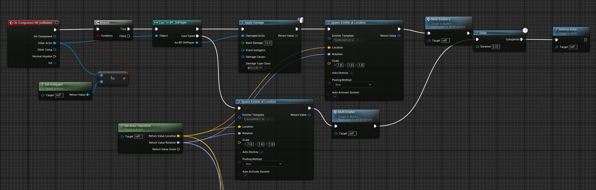
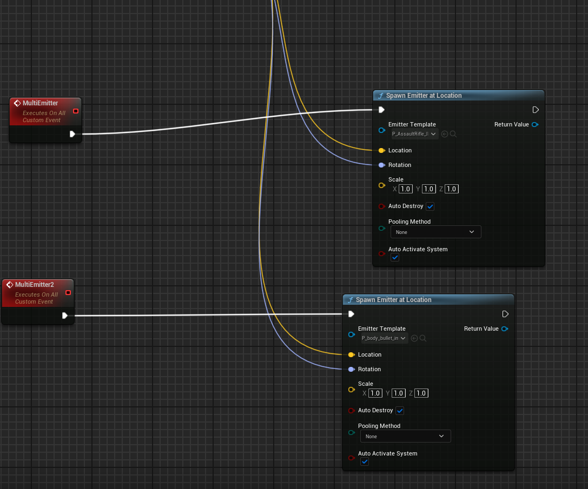

# 💥 SHBullets 클래스 문서

`ASHBullets`는 총알(투사체) 역할을 하는 `AActor` 기반 클래스입니다.  
플레이어가 발사하는 탄환을 물리적으로 처리하며,  
충돌 컴포넌트와 이동 컴포넌트를 통해 피격 판정 및 이동 로직을 담당합니다.

---

## 📦 클래스 정의

```cpp
UCLASS()
class ASHBullets : public AActor
```

- `AActor`를 기반으로 총알 객체 구현
- 생성 즉시 일정 방향으로 이동하며, 충돌 시 이벤트 처리 가능

---

## 🔧 주요 변수

```cpp
UPROPERTY(EditAnyWhere, BlueprintReadWrite)
USphereComponent* collision;

UPROPERTY(EditAnyWhere, BlueprintReadWrite)
UProjectileMovementComponent* MovementComp;
```

- `collision`: 충돌 판정용 Sphere 컴포넌트  
- `MovementComp`: ProjectileMovement 기반으로 일정 방향으로 이동

---

## 🛠 생성자

```cpp
ASHBullets::ASHBullets() {
    collision = CreateDefaultSubobject<USphereComponent>(TEXT("SPHERE"));
    collision->SetupAttachment(RootComponent);
    MovementComp = CreateDefaultSubobject<UProjectileMovementComponent>(TEXT("COMPONENT"));
    bReplicates = true;
}
```

- 컴포넌트 생성 및 기본 설정
- 멀티플레이를 위한 Replication 활성화

---

## 📌 연동 요소

- 충돌 이벤트(`OnComponentHit`)를 통해 `TakeDamage()` 호출 가능
- `UGameplayStatics` 또는 직접 액터 캐스팅을 통해 플레이어와 상호작용 처리 가능

---

## 💥 충돌 처리 (OnComponentHit)

  


- 총알이 다른 Actor와 충돌했을 때 실행되는 이벤트입니다.
- `Player`와 충돌 시 `ApplyDamage()` 호출 → 체력 감소 및 피격 이펙트 발생
- 환경과 충돌 시 총알이 박히는 이펙트를 재생

---

## ✅ 요약

- `ASHBullets`는 플레이어가 발사하는 **총알 투사체 객체**입니다.  
- 충돌 처리 및 이동은 Unreal Engine의 내장 컴포넌트(`SphereComponent`, `ProjectileMovementComponent`)로 구성되어 있으며,  
- 멀티플레이 상황에서도 적절하게 동작하도록 `bReplicates = true` 설정이 적용되어 있습니다.


