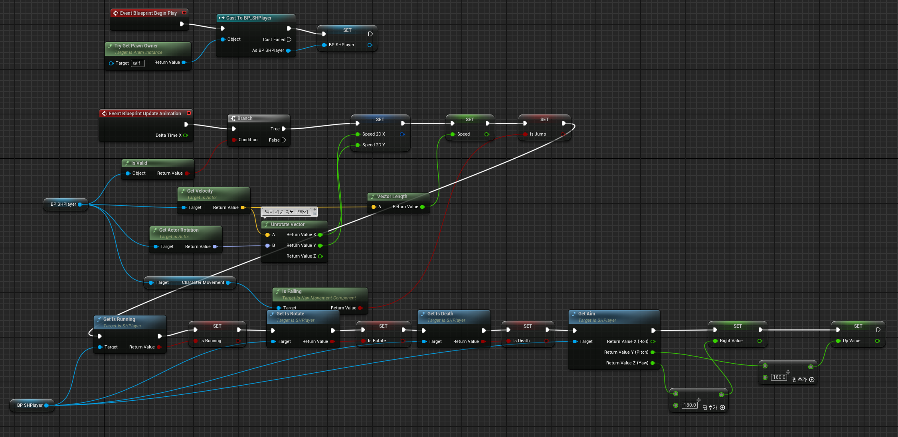
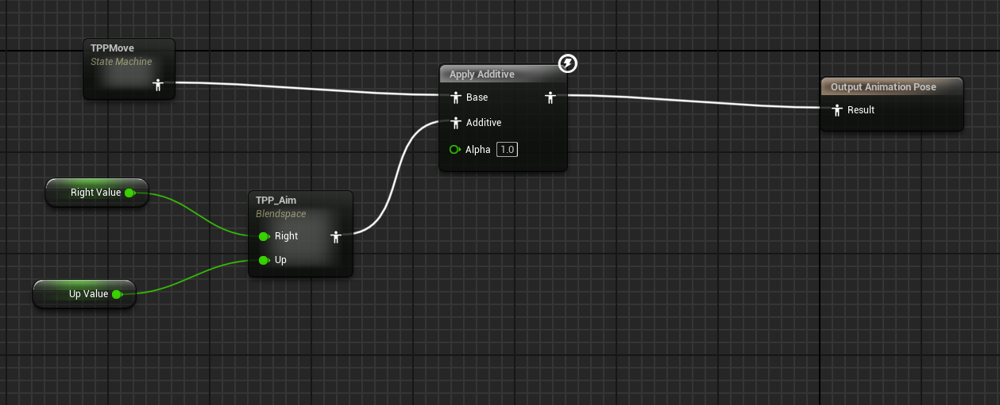
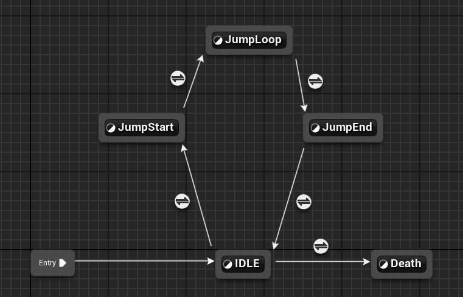
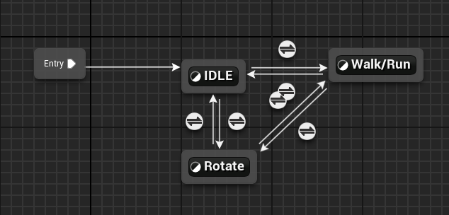
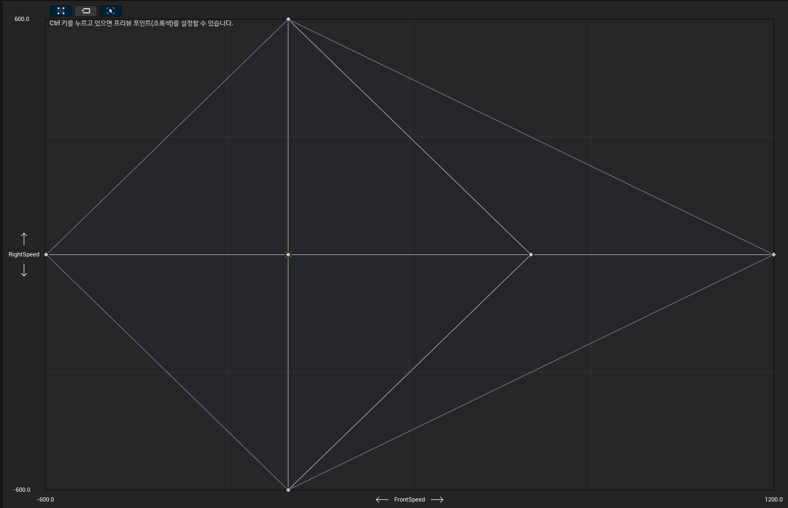

# 🎞️ TPP_ANIM 애니메이션 문서

`TPP_ANIM`은 TPS 시점에서의 플레이어 애니메이션 처리를 담당합니다.  
이동 상태, 시선, 속도 등 다양한 조건에 따라 자연스럽게 애니메이션 전환을 수행합니다.

---

## 🔄 초기화 및 변수 갱신

- 플레이어 상태 및 시선 방향을 바탕으로 애니메이션 파라미터를 갱신합니다.

---

## 🧩 기본 STATE

- `TPPMove`에서 현재 이동 상태(Idle, Run 등) 감지  
- `TPP_Aim`에서 플레이어의 시선을 바탕으로 조준 방향 조정

---

## 🏃 TPPMove

- `Jump` 키가 눌리거나 Death 상태일 경우, Idle 상태에서 애니메이션 상태 변경

---

## 🧍 Idle → WalkRun

- 속도에 따라 상태가 Idle → Walk → Run으로 자연스럽게 전환됨  
- 시선만 좌우로 움직일 때에도 걷는 모션이 약간 들어감

---

## 🚶 WalkRun 애니메이션

- 현재 속도에 따라 Walk 또는 Run 애니메이션 적용

---

## 📦 TPP_WalkRun

- 실제 애님 블루프린트 내 Walk/Run 모션 블렌딩 영역

---

## 🎯 TPP_Aim

- 조준 상태에서 시선 방향과 총기 방향을 정렬하여 조준 애니메이션 적용

